# Table of contents

1. [TCP header](#tcp-header)
2. [Retransmission](#retransmission-of-missing-data----automatic-repeat-request-arq)
3. [Congestion Control](#congestion-control)
4. [Setsocketopt](#setsockopt)
5. [TCP Implementation Overview](#tcp-implementation-overview)
6. [TCP connection states](#tcp-connection-states)
7. [TCP connection open 3-way handshake](#tcp-connection-open-3-way-handshake)
8. [TCP connection close 4-way handshake](#tcp-connection-close-4-way-handshake)
9. [TCP header options](#tcp-header-options)
10. [Maximum Segment Size](#maximum-segment-size)
11. [Path MTU Discovery](#path-mtu-discovery)
12. [Timestamps](#timestamps)
13. [Window Scale](#window-scale)
14. [Quick-Start](#quick-start)
15. [TCP Authentication Option](#tcp-authentication-option)
16. [TCP Fast Open](#tcp-fast-open)
17. [IP header](#ip-header)
18. [IP header flags](#ip-header-flags)
19. [IP header options](#ip-header-options)
20. [IP fragmentation](#ip-fragmentation)
21. [IPv6 Address](#ipv6-address)
22. [IPv6 Header](#ipv6-header)
23. [Linux Sockets](#linux-sockets)

## TCP header

| Field                    | Size (bits) |
|--------------------------|-------------|
| Source Port              | 16          |
| Destination Port         | 16          |
| Sequence Number          | 32          |
| Acknowledgment Number    | 32          |
| Data Offset (Header Len) | 4           |
| Reserved                 | 6           |
| Flags                    | 6           |
| Window Size              | 16          |
| Checksum                 | 16          |
| Urgent Pointer           | 16          |
| Options (if any)         | Variable    |

### Source and Destination Port

Used to identify the endpoints within the source and destination machines

### Sequence Number(32) bits

Used for data sequencing. If the SYN flag is set, this is the initial sequence number.
The sequence number of the actual first data byte and the subsequent ones are used for data ordering, reassembly and loss recovery.

### Acknowledgement Number (32 bits)

If the ACK flag is set, the value of this field is the next sequence number that the sender of the packet is expecting.
This acknowledges the reciept of all prior bytes.

### Data Offset (Header Length)

Indicates the length of the TCP header in 32-bit words. It is needed because Optional fields might vary in length.

### Reserved (6 bits)

Should be set to 0

### Flags (6 bits)

| Flag | Name               | Description                                                                                             | Use Case                                                                                     |
|------|--------------------|---------------------------------------------------------------------------------------------------------|----------------------------------------------------------------------------------------------|
| URG  | Urgent             | Indicates that the Urgent pointer field is significant and that data should be processed immediately.  | Used for data that should be prioritized, such as interrupts or immediate action requests.   |
| ACK  | Acknowledgment     | Acknowledges receipt of data. Must be set in all packets except the initial SYN packet.                | Essential for the reliable delivery mechanism of TCP, confirming receipt of data.            |
| PSH  | Push               | Instructs the receiving host to push this data to the application as soon as possible.                 | Ideal for interactive applications requiring low latency, like telnet or SSH.                |
| RST  | Reset              | Resets the connection due to an error or because a packet was received for a non-existent connection.  | Used to abort a connection if a serious error occurs or to reject invalid packets.           |
| SYN  | Synchronize        | Used during the initial connection setup phase to synchronize sequence numbers.                        | Critical for establishing a TCP connection, initiating sequence number synchronization.     |
| FIN  | Finish             | Indicates that the sender has finished sending data and wishes to terminate the connection.           | Used to gracefully close a TCP connection after the data transfer is complete.               |

### Window Size (16 bits)

#### Flow Control

The size of the sender's receive window(or buffer space available), which controls the flow of data to prevent a receiver from being overwhelmed by too much data at once.

### Checksum (16 bits)

Used for error-checking of the header and data. It's calculated by the sender and verified by the receiver to ensure data integrity.

This is how checksum is calculated:-

1. A pseudo header is constructed

#### IPv4 Pseudo Header Format

| Field              | Size (bits) | Description                                |
|--------------------|-------------|--------------------------------------------|
| Source Address     | 32          | The IPv4 address of the sender.            |
| Destination Address| 32          | The IPv4 address of the receiver.          |
| Zeros              | 8           | Reserved field set to zero.                |
| Protocol           | 8           | Protocol number for TCP (6).               |
| TCP Length         | 16          | Length of the TCP header and data in bytes.|

#### IPv6 Pseudo Header Format

| Field              | Size (bits)  | Description                                         |
|--------------------|--------------|-----------------------------------------------------|
| Source Address     | 128          | The IPv6 address of the sender.                     |
| Destination Address| 128          | The IPv6 address of the receiver.                   |
| TCP Length         | 32           | Length of the TCP header and data in bytes.         |
| Zeros              | 24           | Reserved for future use, set to zero.               |
| Next Header        | 8            | Identifies the protocol used (TCP is represented as 6).|

**Preparation for Checksum Calculation**:
The pseudo header, the TCP header, and the TCP data are arranged in a sequence of 16-bit words for the purpose of checksum calculation.

**Checksum Computation**:
The checksum algorithm sums all 16-bit words using 1's complement arithmetic. The sum itself is also represented as a 16-bit word and its 1's complement is taken to producte the final checksum value.

### Urgent Pointer (16 bits)

If the URG flag is set, this 16-bit field is an offset from the sequence number indicating the last urgent data byte.

### Options (variable)

The length of this field is determined by the data offset field. Options can control various aspects of the TCP connection, like maximum segment size, window scaling, selective acknowledgement etc...

## Retransmission of missing data -- Automatic Repeat reQuest (ARQ)

The process involves use of acknowledgements (ACKs) and timers.

### Positive Acknowledgement with Retransmission(PAR)

Each TCP segment is acknowledged by the receiver. If the sender doesn't receive an ACK for a particular segment within a certain time frame, it assumes that the segment was lost or corrupted and retransmits it.

### Selective Acknowledgements(SACK)

The receiver informs the sender about all the segments that have been received successfully. This way, the sender only needs to transmit the segments that have not been acknowledged, rather than transmitting all segments following a missing segment.

### Timers

#### Retransmission Timer

Each time a segment is sent, a retransmission timer is started for a segment. If the timer expires before an acknowldegement is received, the segment is retransmitted.

#### Exponential Backoff

To manage congestion and to avoid overwhelming the network or the receiver, the restransmission timer is often set to double after each consecutive timeout for the same segment, up to a certain limit.

#### Fast Retransmission

Another mechanism that triggers retransmission is the detection of three duplicate ACKs.
If the sender receives three ACKs for the same data(indicating that the segment immediately following the acknowledged data has not been received), it does not wait for the retransmission timer to expire before restransmitting the missing segment.

## Congestion Control

### Round Trip Time (RTT)

It represents the amount of time it takes for a data packet to travel from sender to the receiver and for an acknowledgement of that packet to return to the sender.

### Slow Start Phase

#### Initialization

When a new TCP connection is established, Slow Start initializes the congestin window size **cwnd** to a small value, typically 1 or 2 segments.

#### Exponential increment

Initially, congestion window (cwnd) = 1
After 1 RTT, cwnd = 2^(1) = 2
2 RTT, cwnd = 2^(2) = 4
3 RTT, cwnd = 2^(3) = 8

### Congestion Avoidance Phase

#### Additive increment

This phase starts after the threshold value **ssthresh** for the cwnd is reached. After that for each RTT, cwnd = cwnd + 1

### Congestion Detection Phase

#### Case 1: Retransmission due to Timeout

In this case, the congestion possibility is high.

- ssthresh is reduced to half of the current window size.
- set cwnd = 1
- start with the slow start phase again

#### Case 2

Retransmission due to 3 Acknowledgement Duplicates - The congestion possibility is less.

- ssthresh value reduces to half of the current window size.
- set cwnd = ssthresh
- start with the congestion avoidance phase.

## Setsockopt

List of some common socket options that can be passed to `setsockopt()`, along with a brief description of each:

| Level             | Option                       | Description                                                                                   |
|-------------------|------------------------------|-----------------------------------------------------------------------------------------------|
| `SOL_SOCKET`      | `SO_REUSEADDR`               | Allows the socket to bind to an address/port in use.                                          |
| `SOL_SOCKET`      | `SO_KEEPALIVE`               | Keeps connections active by enabling keep-alive messages.                                     |
| `SOL_SOCKET`      | `SO_BROADCAST`               | Allows the sending of broadcast messages.                                                     |
| `SOL_SOCKET`      | `SO_SNDBUF`                  | Sets the send buffer size for the socket.                                                     |
| `SOL_SOCKET`      | `SO_RCVBUF`                  | Sets the receive buffer size for the socket.                                                  |
| `SOL_SOCKET`      | `SO_LINGER`                  | Specifies actions for unsent data when the socket is closed.                                  |
| `SOL_SOCKET`      | `SO_OOBINLINE`               | Allows out-of-band data to be received in the normal data stream.                             |
| `SOL_SOCKET`      | `SO_RCVTIMEO`                | Sets the timeout value that specifies the maximum amount of time a call to `recv()` can block.|
| `SOL_SOCKET`      | `SO_SNDTIMEO`                | Sets the timeout value specifying the maximum amount of time a call to `send()` can block.    |
| `IPPROTO_IP`      | `IP_TTL`                     | Sets the time-to-live field of IP packets.                                                    |
| `IPPROTO_IP`      | `IP_MULTICAST_TTL`           | Sets the TTL for multicast packets.                                                           |
| `IPPROTO_IP`      | `IP_MULTICAST_LOOP`          | Controls loopback of multicast packets.                                                       |
| `IPPROTO_IP`      | `IP_ADD_MEMBERSHIP`          | Adds the socket to the multicast group.                                                       |
| `IPPROTO_IP`      | `IP_DROP_MEMBERSHIP`         | Drops the socket from the multicast group.                                                    |
| `IPPROTO_IPV6`    | `IPV6_V6ONLY`                | Restricts the socket to IPv6 traffic only.                                                    |
| `IPPROTO_IPV6`    | `IPV6_JOIN_GROUP`            | Joins the specified IPv6 multicast group.                                                     |
| `IPPROTO_IPV6`    | `IPV6_LEAVE_GROUP`           | Leaves the specified IPv6 multicast group.                                                    |
| `IPPROTO_IPV6`    | `IPV6_MULTICAST_HOPS`        | Sets the hop limit for IPv6 multicast packets.                                                |
| `IPPROTO_TCP`     | `TCP_NODELAY`                | Disables the Nagle algorithm to send small packets immediately.                               |
| `IPPROTO_TCP`     | `TCP_MAXSEG`                 | Specifies the maximum segment size.                                                           |
| `IPPROTO_TCP`     | `TCP_KEEPIDLE`               | Sets the timeout value before the first keepalive probe is sent.                              |
| `IPPROTO_TCP`     | `TCP_KEEPINTVL`              | Sets the interval between successive keepalive probes.                                        |
| `IPPROTO_TCP`     | `TCP_KEEPCNT`                | Sets the number of keepalive probes before a connection is considered dropped.                |

This table provides an overview of some of the options you can set with `setsockopt()` to customize the behavior of your sockets in a POSIX environment.

## TCP Implementation Overview

- ### Protocol registration

  TCP, like other network protocols in the Linux kernel, is registered in the networking subsystem using a protocol family-specific structure
  (**inet_connection_sofk_af_ops** for IPv4, for example). The registration process includes pointers to functions that handle various aspects of the protocol, such as socket creation, state transitions and data transmission/reception.

- ### Socket Layer Integrations

  At user levet, applications interact with TCP through sockets using the socket API:-
  - **socket()**
  - **connect()**
  - **listen()**
  - **accept()**
  - **send()**
  - **recv()**

- ### TCP Control Blocks

  The main data structures used to manage TCP connections are:-
  - **sock(or socket)**: Represents and endpoint for communication.
  - **inet_sock**: Inherits from **sock** and is used for IP-based sockets, adding fields specific to UP protocols like IP addresses and ports.
  - **tcp_sock**: Further specializes inet_sock for TCP, containing TCP-specific information such as sequence numbers, window sizes and various flags indicating the state of the TCP connection.

- ### TCP State Machine

  Different states of TCP connection are
  - **LISTEN**
  - **SYN_SENT**
  - **SYN_RECEIVED**
  - **ESTABLISHED**
  - **FIN_WAIT_1**
  - **FIN_WAIT_2**
  - **CLOSE_WAIT**
  - **CLOSING**
  - **CLOSED**
  - **LAST_ACK**
  - **TIME_WAIT**
  - **BOUND**

#### TCP Client state machine


#### TCP Server state machine


#### Message Flow

```mermaid
sequenceDiagram
    participant Client
    participant Server

    %% Color legend
    Note right of Client: 🟦 Client State
    Note left of Server: 🟥 Server State

    Note over Client,Server: 🔄 Connection Setup (3-Way Handshake)

    activate Client
    Client->>Server: SYN
    Note right of Client: 🟦 SYN_SENT
    Note left of Server: 🟥 LISTEN → SYN_RECEIVED

    activate Server
    Server->>Client: SYN + ACK
    Note left of Server: 🟥 SYN_RECEIVED
    Note right of Client: 🟦 SYN_SENT → ESTABLISHED

    Client->>Server: ACK
    Note right of Client: 🟦 ESTABLISHED
    Note left of Server: 🟥 SYN_RECEIVED → ESTABLISHED

    Note over Client,Server: 📡 Data exchange (both in ESTABLISHED)

    Note over Client,Server: 🔚 Connection Termination

    Client->>Server: FIN
    Note right of Client: 🟦 ESTABLISHED → FIN_WAIT_1
    Note left of Server: 🟥 ESTABLISHED → CLOSE_WAIT

    Server->>Client: ACK
    Note right of Client: 🟦 FIN_WAIT_1 → FIN_WAIT_2

    Server->>Client: FIN
    Note left of Server: 🟥 CLOSE_WAIT → LAST_ACK
    Note right of Client: 🟦 FIN_WAIT_2 → TIME_WAIT

    Client->>Server: ACK
    Note right of Client: 🟦 TIME_WAIT
    Note left of Server: 🟥 LAST_ACK → CLOSED

    deactivate Server
    deactivate Client

    Note right of Client: 🟦 TIME_WAIT → CLOSED (after 2MSL)
```



- ### Buffers and Queues

  - #### Send Buffer

  - #### Receive Buffer

  - #### Out-of-Order Queue

- ### Congestion Control and Flow Control

  Implementation includes algorithms for congestion control and flow control. These mechanisms adjust the rate of data transmission based on network conditions and receiver capabilities to optimize throughput and prevent congestion.

- ### Timer

  Various timers used to manage retransmission, detect dead connections etc.

## TCP connection states

| State             | Description                                                                                   |
|-------------------|-----------------------------------------------------------------------------------------------|
| `CLOSED`          | Indicates that the connection is not currently in use.                                        |
| `LISTEN`          | Waiting for a connection request from any remote TCP and port.                                |
| `SYN_SENT`        | A connection request has been sent; waiting for acknowledgment.                               |
| `SYN_RECEIVED`    | Initial synchronization (SYN) request received and responded with SYN-ACK; awaiting ACK.      |
| `ESTABLISHED`     | The connection has been established; data can be sent and received.                           |
| `FIN_WAIT_1`      | The application has requested to close the connection; waiting for the remote TCP to acknowledge the request. |
| `FIN_WAIT_2`      | The first FIN has been acknowledged; waiting for the remote TCP's connection termination request. |
| `CLOSE_WAIT`      | The remote TCP has initiated a connection termination request; waiting for the application to request to close the connection. |
| `CLOSING`         | Both sides have initiated a connection termination but neither side has completed it yet.     |
| `LAST_ACK`        | Waiting for the last acknowledgment after sending a termination request and receiving a FIN.  |
| `TIME_WAIT`       | Waiting for enough time to pass to ensure the remote TCP received the acknowledgment of its connection termination request. |
| `BOUND`           | Optional state used to indicate that the socket is bound to an address but not yet in a state where it is ready to connect or listen. (Not always considered a distinct TCP state in all implementations.) |

These states are part of the TCP finite state machine, which governs the lifecycle of a TCP connection from initiation through data transfer and finally to termination. Understanding these states is crucial for diagnosing network issues and for developing network applications.

## TCP connection open 3-way handshake

- ### SYN SENT

  Client sends a TCP segment with the SYN buti set to 1. This segment also includes an initial sequence number chosen by the sender to start the sequence numbers of the segments it will send.

- ### SYN-ACK Received

  The server receives the SYN request, responds with a TCP segment that has both the SYN and ACK bits set to 1. The ACK bit acknowledges the sender's SYN packet by including an acknowledgement number that is one more than the received initial sequence number. The receiver also sets it ISN.

- ### ACK Sent

  The client receives the SYN-ACK packet and responds with a TCP segment where the ACK bit is set to 1. This acknowledgement packet includes and acknowledgement number that is one more that the received initial sequence number from the receiver.

## TCP connection close 4-way handshake

- ### FIN from Client

  Client sends a TCP segment with FIN flag set to 1.

- ### ACK from Server

  The server sends ACK.

- ### FIN from Server

  The server sends FIN segment to client

- ### Ack from Client

  THe client sends ACK to acknowledge the FIN.The client goes to TIME_WAIT state  ( usually a duration of 2*MSL - Maximum Segment Lifetime) to ensure all packets have been properly received and to avoid potential conflicts with the new connection.

## TCP Keepalive Mechanism

```mermaid
sequenceDiagram
    participant Client
    participant Server

    Note over Client,Server: 🔄 Initial Data Exchange

    Client->>Server: [SEQ=1000, LEN=100]
    Note right of Server: Received up to byte 1099

    Server-->>Client: [ACK=1100]
    Note left of Client: ACKs up to byte 1099

    Client->>Server: [SEQ=1100, LEN=50]
    Note right of Server: Received up to byte 1149

    Server-->>Client: [ACK=1150]
    Note left of Client: ACKs up to byte 1149

    Note over Client,Server: ⏱️ Idle period begins...

    Note over Client: After keepalive timeout (e.g. 300s)

    Client->>Server: [SEQ=1149, ACK=1150, LEN=0] (Keepalive probe)
    Note right of Server: Duplicate ACK range

    Server-->>Client: [ACK=1150] (Keepalive response)

    Note over Client: More keepalives will be sent periodically if no response
```



## TCP header options

Here's an expanded table that includes both the previously mentioned TCP options and some additional ones, capturing a broader range of TCP header options for enhanced functionalities and optimizations:

| Option                         | Description                                                                                                                                                              | Use Case                                                                 |
|--------------------------------|--------------------------------------------------------------------------------------------------------------------------------------------------------------------------|-------------------------------------------------------------------------|
| Maximum Segment Size (MSS)     | Specifies the max amount of data in a single TCP segment.                                                                                                               | Optimizes segment size to prevent IP fragmentation.                     |
| Window Scale (WSopt)           | Scales the window size field to allow for larger window sizes.                                                                                                           | Enhances data transmission efficiency in high-speed networks.           |
| Selective Acknowledgment (SACK)| Allows acknowledging non-contiguous blocks of data.                                                                                                                      | Improves efficiency in lossy conditions by reducing unnecessary retransmissions. |
| Timestamps                     | Supports RTT measurements and protects against sequence number wrapping (PAWS).                                                                                         | Enables accurate RTT calculation and handles sequence number issues in long-lived connections. |
| No-Operation (NOP)             | Used as padding to align options on 32-bit boundaries or as filler.                                                                                                      | Facilitates option alignment without conveying specific functionality.  |
| End of Option List (EOOL)      | Marks the end of the options list in the TCP header.                                                                                                                     | Indicates where options end and payload data begins.                    |
| Experimental (EXP)             | Reserved for experimental use, identified by specific kinds.                                                                                                             | Used for testing new features not intended for general use.             |
| Quick-Start Response (QS)      | Allows TCP connections to request and use higher initial sending rates.                                                                                                  | Reduces time to ramp up to full speed in high-capacity networks (experimental). |
| User Timeout Option (UTO)      | Configures the user timeout value for unacknowledged data.                                                                                                               | Defines the maximum time before a connection is forcibly closed due to unacknowledged data. |
| TCP Authentication Option (TCP-AO) | Provides a mechanism for authenticating TCP segments.                                                                                                                  | Enhances security by preventing unauthorized segment insertion.          |
| Multipath TCP (MPTCP)          | Allows multiple paths for a single TCP flow.                                                                                                                             | Improves redundancy and potentially increases throughput.               |
| TCP Fast Open (TFO)            | Allows data to be sent during the initial handshake process.                                                                                                             | Reduces the latency involved in opening a TCP connection.               |

This table includes a range of TCP options designed to address various network conditions, performance optimization needs, and security requirements, showcasing the protocol's adaptability and evolution over time.

## Maximum Segment Size

During connection establishment, the client and the server set the MSS option in their SYN packet.
MSS is calculated as follows:
MSS = Interface MTU - IP header size - TCP header size
    = 1500 - 20 - 20
    = 1460 bytes

### Path MTU Discovery

- **Don't Fragment (DF) bit**: The source sets the DF bit in the IP header of outgoing packets. This instructs routers not to fragment these packets.
- **Sending Initial Packets**: The source initially sends packets with MTU of its local interface.
- **Fragmentation Needed and DF set**: If any of the packets encounter a router with a smaller MTU on the path to the destination, the router drops thepacket and sends back an ICMP "Fragmentation Needed and DF set" message to the source. This message includes the MTU of that link indicating thelargest packet size it can forward.
- **Adjusting the MTU**: The source adjusts its packet size to match the reported MTU and retransmits the packet.
For IPV6, ICMPv6 "Packet too big" message is generated.

## Timestamps

The TCP timestamps option serves two primary purposes:

- RTT (Round Trip Time)
- PAWS (Protection against wrapped sequence numbers)
It consists of two fields, each 4 bytes long:
- **TS Value (TSval)**: Contains the current value of the timestamp clock of the TCP sender.
- **TS Echo Reply (TSecr)**: Used to echo the most recent Timestamp value received from the remote TCP endpoint.

### Enabling Timestamps

- The use of the timestamps option is negotiated at the start of the TCP connection. Both TCP endpoints must indicate their support for the option in the SYN segments during the 3-way segment.
- Once enabled, all TCP segments sent during the connection should include the Timestamps options

### Round-Trip Time Measurement

- **Timestamping packets:** When a TCP segment is sent, the sender includes its current timestamp in the TSval field.
- **Echoing Timestamps:** The receiver echoes this timestamp back to the sender in the TSecr field of its ACK packets.
- **Calculating RTT:** By comparing the echoed timestamp with its current timestamp, the sender can accurately calculate RTT.

### Protection against Wrapped Sequence Numbers (PAWS)

- **Sequence Number Wraparound:** With high-speed networks, and long duration connections, there's a theoritical risk that TCP sequence numbers mightwrap around.
- **Timestamps as a Solution:** The Timestamps option helps to distinguish between new and old segments that might have the same sequence numbers, bychecking the timestamp values. A TCP segment is discarded if it has a sequence number that appears to be valid but carries an older timestamp thanexpected.
- **Timestamp Validation:** Each TCP segment's timestamp is compared against the last received timestamp to ensure that no out-of-date segments are accepted.

## Window Scale

The TCP window size field in the header specifies the amount of data in bytes that a sender can transmit before needing an acknowledgement from the reciever, effectively controlling the flow of data to prevent congestion. However, the original TCP specification limits this field to 16 bits, capping the maximum window size at 64KB, which can be insufficient for modern high-speed networks.

- **Purpose:** It extends the maximum window size beyond 65535 bytes by allowing both sender and receiver to negotiate a scale factor used toleft-shift the window size value. The scale factor increases the effective range of the window size.
- **Negotiation During Connection Establishment:** Both the client and server must indicate their support for the the Window Scale option in theoptions field of their initial SYN and SYN-ACK packets.
- **Scale Factor:** The scale factor is a single byte in length, allowing a maximum shift of 14 bits. This means the maximum window size can be scaledup to 1GB (2^14 * 64KB).
- **Applications:** The Window Scale factor is applied to window size field in all subsequent TCP segments for the duration of the connection. The window size is only scaled in the direction it is sent. That is, the sender of the window scale option scales the window size it advertises to the receiver according to its own scale factor.
When the Window Scale option is negotiated at the start of a TCP connection, each TCP endpoint informs the other of the scale factor it wishes to apply to the receive window size it advertises. This means:
When Host A sends a Window Scale option in its SYN packet, it's telling Host B, "This is the scale factor you should apply to the window size I advertise to you." In other words, Host A is determining how its inbound window size (for data it receives) is scaled.
Conversely, when Host B responds with its own Window Scale option, it's specifying the scale factor that Host A should apply to the window size Host B advertises to Host A.

## Quick-Start

The Quick-Start Request and Quick-Start Response options in TCP were proposed as a mechanism to allow TCP connections to quickly utilize available bandwidth in situations where the network is under-utilized. The traditional slow-start mechanism in TCP, designed to prevent congestion, can be sometimes too conservative. The Quick-Start process aims to address this by allowing a sender to request permission from routers along the path to send data at a higher initial rate.

### How Quick-Start Works

1. #### Quick-Start Request

    In the TCP header or IP header of a packet, the sender includes a Quick-Start Request, specifying a desired transmission rate in terms of bytes per interval. This request is made during the initial stages of the connection or when the connection has been idle for a long period.

2. #### Router Processing

   - Each router along the path checks its current load. If it can accommodate the requested rate without causing congestion, it forwards the packet, possibly adjusting the rate in the Quick-Start Request to a lower value if necessary based on its current capacity.
   - If any router cannot accommodate the request, it reduces the rate to what it can support or mars the Quick-Start Request as not approved.

3. #### Quick-Start Response

   - The receiver of the Quick-Start Request packet reads the rate approved by the network and sends a Quick-Start Response back to the sender, indicating the rate that the sender is allowed to use.

4. #### Sender's Adjustment

     - Upon receiving the Quick-Start Response, the sender adjusts its sending rate according to the approved rate. This adjustment allows the sender to bypass the slow start phase, immediately increasing its transmission rate to the approved level, thereby improving the efficiency of data transfer.

### Quick-Start as IP header option

#### IP Options Field

It is also implemented as an IP option in the IP header to negotiate a higher initial data rate.

#### Format

The Quick-Start option in the IP header contains information such as the Rate Request, the QS Nonce, and the TTL of the packet when the Quick-Start Request was generated.

#### Router Processing

 As the IP packet with the Quick-Start option traverses the network, each router examines this option. If the router supports Quick-Start and has sufficient available bandwidth, it can approve or adjust the rate. If the router does not support Quick-Start or cannot accommodate the request, it can modify the option to indicate that the Quick-Start Request was not approved.

## TCP Authentication Option

It provides a way to authenticate TCP segments, ensuring that they are sent by the actual endpoints of the TCP connection and not by the attackers.

### Key Features and Principles of TCP-AO

- **Message Authentication Code(MAC):** TCP-AO uses a MAC to authenticate TCP segments. The MAC is calculated over the TCP segment, including a pseudo-header and a shared secret key.
- **Key Management:** TCP-AO does not specify the key management mechanism within the protocol itself, allowing for the flexibility in how keys are distributed, managed and refreshed.
- **Replay Protection:**: TCP-AO includes mechanisms for replay protection, ensuring that captured packets cannot be resent by an attacker in an attempt to disrupt the connection or inject malicious data.
- **Algorithm Agility:** TCP-AO is designed to be algorithmically agile, meaning it can support various MAC algorithms

### How TCP-AO works

- **Setup:** Both ends of a TCP connection agree on a secret key and MAC algorithm. This agreement can be achieved through manual configuration or through automated key management protocols.
- **Segment Processing:** When a TCP segment is ready to be sent, the sender computes the MAC over the segment's content (including pseudo header and TCP-AO speficif fields) using the agreed-upon key. The resulting MAC is included in TCP-AO option of the segment.
- **Verification:** Upon receiving a segment with the TCP-AO option, the receiver computes the expected MAC using the same algorithm and key, then compares it with the MAC value included in the segment. If the values match, the segment is considered authentic, if not it is discarded.
- **Key Change and Replay Protection:** TCP-AO can employ techniques like sequence numbers or time-based counters to protect against replay attacks. Keys can be rotated periodically to maintain security.

### Use Cases

- **BGP Sessions:** TCP-AO is particularly useful for securing BGP sessions between routers, where session hijacking or injection of incorrect routing information by attackers could have significant impacts on network routing.
- **Data Centers and Critical Infrastructure:** Anywhere that TCP connections need protection from tampering, or session hijacking, especially where critical data is transmitted or system integrity is paramount.

## TCP Fast Open

- **TCP Cookie:** A cryptographic token generated by the server and sent to the client during an initial TFO-enabled connection. This cookie is essentially a secure server-specific identifier that the client stores and presents in subsequent connection attempts to the same server.
- **Initial Connection:** During the first connection to a TFO enabled server, the client may not have a valid cookie, so it proceeds with a standard TCP handshake. However, it indicates its support for TFO. In response, the server provides a TFO cookie to the client.
- **Subsequent Connections:** When the client initiates subsequent connections to the server, it includes the server's TFO cookie within the SYN packet of the TCP handshake. This allows the server to validate the client's request quickly and permits the client to send data to the server in the initial SYN packet itself, without waiting for the handshake to complete.
- **Server Response:** If the server recognizes and validates the TFO cookie, it can accept the data in teh SYN packet and proceed with its ACK and possible response data, all while completing the handshake. This effectively reduces the connection establishment process from requiring two RTTs (Handshake + data transmission) to just one RTT.

## IP header

The IP (Internet Protocol) header is a crucial component of the data packets used for communication over networked devices. It contains various fields that provide instructions and information required for the routing and delivery of the packet from the source to the destination. Below is a table that explains the fields found in an IP header, particularly focusing on the IPv4 header for simplicity.

| Field                 | Size (Bits) | Description                                                                                   |
|-----------------------|-------------|-----------------------------------------------------------------------------------------------|
| Version               | 4           | Indicates the version of the IP protocol. IPv4 is denoted by 4.                               |
| Internet Header Length (IHL) | 4    | Specifies the header's length in 32-bit words. It points to where the data begins.           |
| Type of Service (ToS) | 8           | Provides information about the packet's priority and the type of service desired.             |
| Total Length          | 16          | Specifies the entire packet's size in bytes, including header and data.                       |
| Identification        | 16          | Used for uniquely identifying the group of fragments of a single IP datagram.                 |
| Flags                 | 3           | Controls and identifies fragments. Includes flags for more fragments and don't fragment.      |
| Fragment Offset       | 13          | Indicates where in the datagram this fragment belongs.                                        |
| Time to Live (TTL)    | 8           | Limits the datagram's lifetime, reducing by at least one each time it passes a router.        |
| Protocol              | 8           | Indicates the next level protocol used in the data portion of the IP datagram.                |
| Header Checksum       | 16          | Used for error-checking of the header.                                                        |
| Source Address        | 32          | Specifies the sending node's IP address.                                                      |
| Destination Address   | 32          | Specifies the receiving node's IP address.                                                    |
| Options               | Variable    | Allows for various internet layer parameters to be set; it is optional and variable in length.|
| Padding               | Variable    | Ensures the header is a multiple of 32 bits in length. Used if the Options field is used.     |

This table outlines the structure and purpose of each field within an IPv4 header, offering a fundamental understanding of how IP packets are constructed and managed across networks. IPv6 headers have a different structure and set of fields, designed to accommodate a larger address space and improve the efficiency of packet handling.

## IP header flags

The IP header includes a field for flags, which is used to control or identify fragments of a datagram. These flags are part of the fragmentation and reassembly process, allowing a large datagram to be broken into smaller fragments for transmission over a network that cannot support the original datagram size. Upon reaching the destination, these fragments can be reassembled to form the original message. The flags field is 3 bits in length, and here's a breakdown of what each bit represents in a tabular form:

| Bit  | Name                 | Description                                                                                    |
|------|----------------------|------------------------------------------------------------------------------------------------|
| 0    | Reserved             | Always set to 0; it's a reserved bit and not used.                                             |
| 1    | Don't Fragment (DF)  | If set to 1, the datagram cannot be fragmented. It's used to ensure the packet remains intact. |
| 2    | More Fragments (MF)  | If set to 1, indicates that this packet is not the last fragment of a datagram.                |

- **Reserved (Bit 0):** This bit is reserved for future use and should always be set to 0.
- **Don't Fragment (DF) (Bit 1):** When set, it tells routers not to fragment this packet. If the packet size exceeds the Maximum Transmission Unit (MTU) of the network and this bit is set, the packet will be dropped, and an ICMP error message is sent back to the sender.
- **More Fragments (MF) (Bit 2):** This bit is used to control the fragmentation process. If set, it indicates that this packet is a fragment and that more fragments are following this one. The last fragment of a packet has this bit cleared to signal the end of the fragments.

Understanding these flags is essential for troubleshooting network issues related to packet fragmentation and ensuring efficient data transmission over networks with varying MTUs (Maximum Transmission Units).

## IP header options

| Option Name                       | Option Code | Description                                                                                                  | Use Cases                                                                                     |
|-----------------------------------|-------------|--------------------------------------------------------------------------------------------------------------|-----------------------------------------------------------------------------------------------|
| End of Option List                | 0           | Indicates the end of the option list.                                                                        | Marks the end of options in the IP header.                                                    |
| No Operation (NOP)                | 1           | Used for padding to align subsequent options or for separating options.                                      | Alignment and separation of options in the IP header.                                         |
| Security                          | 130         | Provides a way to carry security classification levels for the data.                                         | Used for transmitting sensitive data across networks with security classifications.            |
| Loose Source Routing (LSR)        | 131         | Allows the sender to specify an intermediate route for the packet.                                           | Testing, debugging, or specific routing needs to dictate a packet's path through the network. |
| Internet Timestamp                | 68          | Records timestamps for each point the datagram traverses.                                                    | Diagnostics, including round-trip time measurements and identifying path issues.               |
| Record Route                      | 7           | Records the route of an IP packet as it traverses the network.                                               | Route tracking and diagnostics to see the path taken by packets.                              |
| Strict Source Routing (SSR)       | 137         | Specifies a strict list of routers through which the packet must pass.                                       | Specifying an exact path for a packet to follow through the network.                          |
| Stream ID (Deprecated)            | 136         | Used to identify a particular stream of data between a source and destination.                               | (Deprecated) Used in experimental protocols, not common in general networking.                |
| Extended Security (Deprecated)    | 133         | Was intended for additional security features beyond the basic Security option.                               | (Deprecated) Enhanced security measures.                                                      |
| Commercial Security (Deprecated)  | 134         | Aimed to provide commercial security levels.                                                                  | (Deprecated) Commercial-level security.                                                       |
| Router Alert                      | 148         | Allows a host to specify that routers should examine this packet more closely.                               | Ensuring packets are processed by routers for functions like RSVP or IGMP.                    |
| Selective Directed Broadcast Mode | 149         | Specifies how a packet should be distributed when it reaches a directed broadcast address.                   | Controlling the distribution of broadcast packets in a network.                              |
| Traceroute                        | 82          | Used to record information about the route a packet has taken, intended for diagnostic purposes.             | Network diagnostics and path tracing.                                                        |
| Address Extension                 | 147         | Used for carrying additional source or destination addresses, for special routing purposes.                  | Special routing scenarios requiring additional addresses.                                    |
| Quick-Start                       | 25          | Used to request and report the available bandwidth between hosts, for congestion control.                    | Congestion control and bandwidth management.                                                  |
| MTU Probe                         | 11          | Used to discover the Path MTU between two IP hosts.                                                         | Discovering the maximum transmission unit path to avoid fragmentation.                        |
| MTU Reply                         | 12          | A response to the MTU Probe, indicating the discovered Path MTU.                                            | Responding to MTU discovery processes.                                                        |
| Experimental                      | Various     | Reserved for experimental use, allowing for the testing of new features without affecting standard operations.| Testing and development of new network technologies and features.                             |

This table encompasses a range of IP header options, from those integral to the protocol's operation to those that are deprecated or used for specific, less common purposes. The actual implementation and support for these options can vary, and their usage can impact network performance, security, and compatibility.

## IP fragmentation

The following fields of the IP header are used in fragmentation

- ### Total Length

  Specifies the total length of the IP datagram, including the header and the data.

- ### Identification

  All fragments of a packet carry the same Identification value, enabling the receiving end to group them together correctly.

- ### Flags
  
  - **DF(Don't Fragment):** If set, the flag indicates that the packet should not be fragmented.
  - **MF(More Fragments):** This flag is set on all fragments except the last one.

- ### Fragment Offset

  This field indicates the position of the fragment's data within the original IP packet.It is 13 bits long. It contains a value that represents the offset, or position, of the fragment's data in the original IP packet. The offset is measured in units of 8 bytes (64 bits).

  #### Example

  If an IP packet is 4000 bytes long, and has to pass through a network with an MTU of 1500 bytes, excluding the header (assuming 20 bytes of IP header) each fragment can carry up to 1480 bytes of the original packet's data.

  - The first fragment would have a Fragment Offset of 0.
  - The second fragment would carry the next portion of the data. Its Fragment Offset would be 185 (1480/8), indicating that the data starts at byte 1480 of the original packet.

## IPv6 Address

### Length

128 bits

### Representation

IPv6 addresses are represented as eight groups of four hexadecimal digits, each group representing 16 bite. The groups are separated by *:*.
For example: 2001:0db8:85a3:0000:0000:8a2e:0370:7334

### Zero Compression

IPv6 allows for the omission of leading zeroes within any 16-bit block and the replacement of one or more consecutive all-zero blocks with a double colon (::).
However, the double colon can appear only once in an address to prevent ambiguity.
For example: 2001:db8:85a3::8a2e:370:7334

### Types of IPv6 addresses

#### Unicast Address

Indentify a single interface. A packet sent to a unicast address is delivered to the interface identified by that address.

- **Global Unicast Address (GUA):** Similar to public IPv4 addresses.
- **Link-Local Unicast Address:** Used for communication within a single network segment. They are not routable beyond their local link and have a prefix of fe80::/10
- **Unique Local Addresses(ULA):** Similar to IPv4's private range addresses, meant for local communication withing a site or between a limited set of sites, with a prefix fc00::/7

#### Multicast Addresses

Represent a group of interfaces, potentially on different nodes. A packet sent to a multicast address is delivered to all interfaces identified by that address.
Identified by the prefixL ff00::/8

#### Anycast Addresses

Assigned to multiple interfaces(usually on different nodes), but a packet sent to anycast address is delivered to nearest interface.

## IPv6 Header

The IPv6 header format is designed to be simpler and more efficient than its IPv4 counterpart. Here's a summary of the IPv6 header fields in a tabular format:

| Field                          | Size (Bits) | Description                                                                                                                                               |
|--------------------------------|-------------|-----------------------------------------------------------------------------------------------------------------------------------------------------------|
| Version                        | 4           | Indicates the version of IP being used. For IPv6, this is set to 6.                                                                                       |
| Traffic Class                  | 8           | Used to differentiate packets within the network, providing similar functionality to the Type of Service (ToS) field in IPv4.                             |
| Flow Label                     | 20          | Used for labeling sequences of packets that require special handling by intermediate routers, aimed at providing quality of service (QoS) features.       |
| Payload Length                 | 16          | Specifies the size of the payload (including any extension headers) in bytes. The maximum payload size is 65,535 bytes, but a larger payload is possible using the Jumbo Payload option. |
| Next Header                    | 8           | Identifies the type of header immediately following the IPv6 header. This field can indicate transport layer protocols (e.g., TCP, UDP) or other extension headers. |
| Hop Limit                      | 8           | Replaces the TTL field in IPv4, determining the maximum number of hops (routers) that the packet is allowed to pass through before being discarded.       |
| Source Address                 | 128         | The 128-bit address of the originator of the packet.                                                                                                       |
| Destination Address            | 128         | The 128-bit address of the intended recipient of the packet.                                                                                                |

Unlike the IPv4 header, the IPv6 header does not include fields for header checksum, fragment offset, or flags for fragmentation. Instead, IPv6 handles fragmentation in the sending host, and for options that need to be communicated, IPv6 utilizes extension headers that follow the initial header and are identified by the "Next Header" field. This streamlined approach aims to facilitate faster processing by routers and support the expansive addressing and routing capabilities required for the modern internet.

## Linux Sockets

### Packet Sockets

**Packet Sockets**, provided by Linux kernel, are specifically designed for direct interaction with Layer 2 packets. Using the socket() system call with **AF_PACKET** as the socket family, an application can send and receive Ethernet frames directly.
Example:

```c
int sockfd = socket(AF_PACKET, SOCK_RAW, htons(ETH_P_ALL));
```

- **AF_PACKET**: Specifies the address family used for packet sockets, allowing direct access to protocol layers.
- **SOCK_RAW**: Indicates raw network protocol access.
- **htons(ETH_P_ALL)**: Specifies that all protocols are received(Ethernet frames), making the socket protocol-agnostic and capable of receiving all Layer 2 packets.

## Raw Sockets

To receive ICMP (Internet Control Message Protocol) packets using sockets, you can use raw sockets in Linux. Raw sockets allow you to receive and send packets at the IP layer, bypassing the higher-level protocols like TCP or UDP. This capability is particularly useful for implementing custom network protocols, network utilities, or handling ICMP packets, which are used for diagnostic or control purposes (e.g., ping, traceroute).

Here’s a basic example in C on how to create a raw socket to receive ICMP packets:

```c
#include <stdio.h>
#include <stdlib.h>
#include <string.h>
#include <sys/socket.h>
#include <netinet/ip.h>
#include <netinet/ip_icmp.h>
#include <arpa/inet.h>
#include <unistd.h>

int main() {
    int sockfd;
    char buffer[1024];
    struct sockaddr_in src_addr;
    socklen_t addr_len;

    // Creating a raw socket to receive all packets (IPPROTO_ICMP for ICMP packets)
    sockfd = socket(AF_INET, SOCK_RAW, IPPROTO_ICMP);
    if (sockfd < 0) {
        perror("Socket creation failed");
        exit(EXIT_FAILURE);
    }

    // Optional: Bind to a specific interface
    //memset(&src_addr, 0, sizeof(src_addr));
    //src_addr.sin_family = AF_INET;
    //src_addr.sin_addr.s_addr = inet_addr("YOUR_INTERFACE_IP");
    //if (bind(sockfd, (struct sockaddr *)&src_addr, sizeof(src_addr)) < 0) {
    //    perror("Bind failed");
    //    exit(EXIT_FAILURE);
    //}

    printf("Receiving ICMP packets...\n");
    while (1) {
        // Receive packets
        ssize_t packet_len = recvfrom(sockfd, buffer, sizeof(buffer), 0, (struct sockaddr *)&src_addr, &addr_len);
        if (packet_len < 0) {
            perror("Packet receive failed");
        } else {
            printf("Received ICMP packet. Length: %zd bytes\n", packet_len);
            // Process the packet here (optional)
        }
    }

    close(sockfd);
    return 0;
}
```

### Key Points

- **Socket Creation:** `socket(AF_INET, SOCK_RAW, IPPROTO_ICMP)` creates a raw socket that receives ICMP packets. `AF_INET` specifies the IPv4 protocol, `SOCK_RAW` allows raw network protocol access, and `IPPROTO_ICMP` specifies the ICMP protocol.

- **Receive Packets:** `recvfrom()` is used to receive packets from the socket. The function fills the buffer with the received packet data and provides the source address.

- **Execution and Privileges:** Running this program requires root privileges because creating raw sockets is restricted to privileged users due to security reasons. You can execute this program with `sudo` or as the root user.

- **Binding to an Interface:** The example above optionally includes code (commented out) to bind the socket to a specific IP address/interface. This step is not required but can be used if you want to receive ICMP packets on a specific interface.

This example demonstrates the basics of receiving ICMP packets. In a real application, you would likely include additional error checking and possibly parse the ICMP message contents based on the ICMP packet structure.

## The Way in which a packet gets lost in a network

This is the result of routing anomalies.
A router crashes or a link between 2 routers goes down and it takes the routing protocols , a seconds or minutes to stabilize and find an alternate path.

During that time period a routing loop can occur ( router A sends packet to router B, and vice versa ) and packets can get caught in these loops.
In the meantime assuming the lost packet is a TCP segment, the sending TCP times out and retransmits the packet, and the retransmitted packet gets to the final destination by some alternate path.

But sometime later ( up to MSL seconds after the lost packet started on it journey ), the routing loop is corrected and the packet that was lost in the loop is sent to the final destination.

This original packet is called "DUPLCIATE" or "WANDERING DUPLICATE". TCP must handle these duplicates.

There are 2 reasons for the TIME_WAIT state :

To implement TCP's full duplex connection termination reliably.
To allow old duplicates segments to expire in the network.

First reason can be explained by looking at the fig 2.5 and assuming that the final ACK is lost. Server will resend its final FIN , so the client must maintain state information, allowing it to resend the final Ack. If it did not maintain this information, it would respond with RST which would be interpreted by the server as an error.

If a TCP is performing all the work necessary to terminate both directions of data flow cleanly for a connection ( its full duplex close ) , then it must correctly handle the loss of any of these 4 segments.  This example also shows why the active close end should wait in TIME_WAIT state : because that end is the one that might have to retransmit the final ACK

Second Reason :
Assume we have a TCP connection : 12.106.32.254:1500    and 206.168.112.219:21
this connection is closed and sometime later , we establish another connection between the same IP and port.

The latter connection is called incarnation of the previous connection since the IP address and ports are same.
TCP must prevent old duplicates from a connection from reappearing at some later time and being misinterpreted as belonging to a new incarnation of the same connection.

To do this,  TCP will not initiate a new incarnation of a connection that is currently in the TIME_WAIT state.
Since the duration of the TIME_WAIT state is twice the MSL seconds for the reply to be lost.

By enforcing this rule, we are guaranteed that when we successfully establish  a TCP connection, all old duplicates from previous incarnations of the connection have expired in the network
